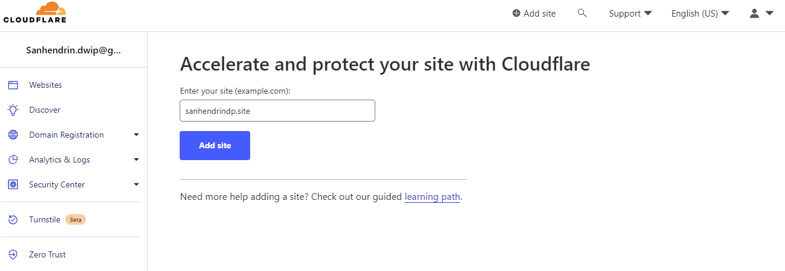

  
  
  
 

               

 <h5 align="center">Website Link</h5>

<a href="https://sanhendrindwip.netlify.app/">sanhendrindwip.netlify.app</a>
·
<a href="https://sanhendrindp.site/">sanhendrindp.site</a>
·
<a href="https://sanhendrindp.site/">www.sanhendrindp.site</a>

# Introduction

In this week 4 assignment, I made a documentation that informed about the deployment process using **Netlify**, buying a domain (.site) using **Niagahoster**, and then custom domains using **Cloudflare**.

  
  
  

# Netlify

### What is Netlify?

Netlify is the platform developers love for building highly-performant and dynamic websites, e-commerce stores and web applications. By uniting an extensive ecosystem of technologies, services and APIs into one workflow, Netlify unlocks new levels of team productivity, while saving time and money.

### Website deployment & web server using Netlify

1. Go to <a href="https://www.netlify.com/">netlify.com</a> and log in or sign up if you don't have an account yet.
   

2. After you log in, **Add new site** then choose you can choose your method to import your project. In this case, choose **Import an existing project**.
   

3. Choose **GitHub** provider for your project. Make sure your project is available in your github repository.
   

4. Choose the repository of your project that you want deploy.
   

5. Choose your branch that you want to make it deploy, and then **Deploy site**.
   

6. Your website has been successfully deployed.
   

### Configure website name in Netlify

1. To change your site name, choose **Domain settings**, in Production domains, choose **options**, then **Edit name site**.
   

2. Change your website name to a name you like, then **Save**.
   

# Niagahoster

### What is Niagahoster?

Niagahoster is a hosting company that provides web hosting service based in Yogyakarta, Indonesia. Apart from hosting and domains, Niagahoster also provides various complementary services such as website creation services, cheap SSL, and email hosting.

### Buy a domain in Niagahoster

1. Go to <a href="https://www.niagahoster.co.id/">niagahoster.co.id</a> and sign up to create an account.
   

2. Search and check your domain name that you want. In this case i choose **.site** as my domain.
   

3. If your domain name avaliable, you only need to choose the duration of the service and make a payment.
   

4. Checkout your domain name with your favorite payment method.
   

5. After your payment complete, you can check your domain name at **Member Area**. wait until the service status is active.
   

# Cloudflare

Cloudflare is a large network of servers that can improve the security, performance, and reliability of anything connected to the Internet. Cloudflare does this by serving as a reverse proxy Open external link for your web traffic.

### DNS management with Cloudflare

1. Go to <a href="https://www.cloudflare.com/en-gb/">cloudflare.com</a> and sign up to create an account.
   

2. After sign up, go to Dashboard to **Add site**.
   

3. Choose Cloudflare Plan to **Free Plan**, then Continue.
   

4. Next step, you must delete the two nameservers currently in use on Niagahoster, then replace it with the new nameserver provided by Cloudflare.
   

5. Go to **Niagahoster Member Area**, **Your Domain**, **Name Server**, then replace them with the new nameservers provided by Cloudflare.
   

6. Access your Cloudflare page again and check nameservers. Wait until your nameservers is active.
   

7. After domain is activate, go to **DNS**, **Records**, you must add CNAME with Netlify link using **add record**.
   

## Setup a custom Domain

1. Go to **Netlify**, choose your site that you already deploy before. Choose **Domain settings**, on **Production domains** choose **Add a domain**.

2. Add Custom Domain that you already setup on Cloudflare, then click **Verify**, then **Add domain**.
   

3. Netlify checking to DNS, and your custom domain is ready.
   
